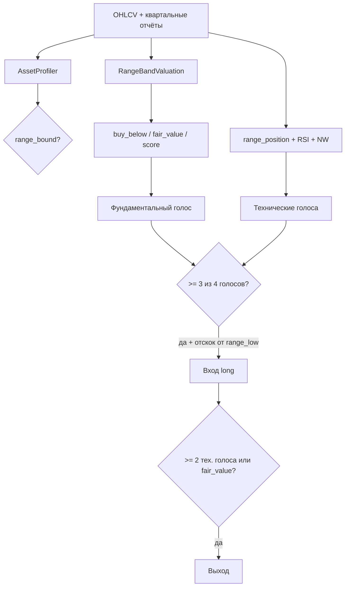

# ПО для работы с акциями компаний ( Технический + Фундаментальный анализ)

Исследовательский бэктестер для акций, которые долго торгуются **в ценовом канале** (range-bound): покупка у поддержки, продажа у сопротивления. Эталонный кейс — **Li Auto (`LI`)**.

Репозиторий: [github.com/Timofey322/flat_stocks](https://github.com/Timofey322/flat_stocks)

> **Не является инвестиционной рекомендацией.** Только research backtest, без подключения к брокеру и live-торговли.

---

## Содержание

1. [Идея и контуры проекта](#идея-и-контуры-проекта)
2. [Стратегия Range Synergy](#стратегия-range-synergy)
3. [Фундаментальный анализ](#фундаментальный-анализ)
4. [Технический анализ](#технический-анализ)
5. [Как фундаментал и техника работают вместе](#как-фундаментал-и-техника-работают-вместе)
6. [Исследование на нескольких компаниях](#исследование-на-нескольких-компаниях)
7. [Быстрый старт](#быстрый-старт)
8. [Структура репозитория](#структура-репозитория)
9. [Утечки данных и ИИ](#утечки-данных-и-ии)
10. [Ограничения](#ограничения)

---

## Идея и контуры проекта

### Задача

Многие акции (особенно китайский автосектор ADR) месяцами ходят **боком** в ценовом коридоре, а не в устойчивом тренде. Для таких бумаг логичнее:

- покупать у **нижней границы** канала;
- продавать у **верхней**;
- отфильтровывать сделки **качеством баланса** (фундаментал);
- подтверждать вход **несколькими независимыми техническими признаками** (синергия).

### Контуры системы (слои)

```
┌─────────────────────────────────────────────────────────────────┐
│  examples/          load_li_reports.py, run_research.py         │
├─────────────────────────────────────────────────────────────────┤
│  pipeline.py        сборка контекста → сигналы → бэктест        │
├──────────────┬──────────────────────┬─────────────────────────────┤
│  data/       │  fundamental/        │  technical/                 │
│  SQLite,     │  snapshot, profiler, │  rolling_range, RSI,        │
│  seeds LI    │  range_band valuation│  Nadaraya–Watson envelope   │
├──────────────┴──────────────────────┴─────────────────────────────┤
│  strategy/range_synergy.py  +  feature_synergy.py (голосование) │
├─────────────────────────────────────────────────────────────────┤
│  backtest/   engine, metrics, alpha vs B&H, walk-forward        │
├─────────────────────────────────────────────────────────────────┤
│  analysis/   leakage_audit, system_report                       │
├─────────────────────────────────────────────────────────────────┤
│  config.py   BEST_STRATEGY_PARAMETERS (единственный вариант)    │
└─────────────────────────────────────────────────────────────────┘
```

| Слой | Назначение | Ключевые файлы |
|------|------------|----------------|
| **Данные** | OHLCV (Yahoo), квартальные отчёты (SQLite + seed) | `data/database.py`, `data/seeds/li_quarterly.json` |
| **Фундаментал** | Режим бумаги, уровни канала, score качества | `fundamental/profiler.py`, `valuation.py` |
| **Техника** | Канал, RSI, NW envelope, ATR | `technical/indicators.py`, `nadaraya_watson.py` |
| **Стратегия** | Правила входа/выхода, синергия признаков | `strategy/range_synergy.py`, `feature_synergy.py` |
| **Бэктест** | Long-only, комиссии, slippage, альфа | `backtest/engine.py`, `alpha.py`, `walk_forward.py` |
| **Анализ** | Аудит утечек, отчёты | `analysis/leakage_audit.py` |

В репозитории оставлен **один лучший вариант** стратегии (максимальная прибыль на train Li Auto). Альтернативы (DCF, growth-профили, NVIDIA, legacy-правила) удалены.

---

## Стратегия Range Synergy

**Range Synergy** = ценовой канал + RSI + **Nadaraya–Watson envelope** + фундаментальный фильтр + **голосование признаков**.

| Параметр | Значение |
|----------|----------|
| Окно канала | 90 дней |
| Вход в канале | `range_position` ≤ 0.30 |
| Выход в канале | `range_position` ≥ 0.80 |
| NW bandwidth / multiplier / lookback | 6.0 / 2.5 / 32 |
| NW вход / выход | position ≤ 0.25 / ≥ 0.68 |
| RSI вход / выход | ≤ 30 / ≥ 70 |
| Голосов на вход / выход | ≥ 3 из 4 / ≥ 2 из 3 |
| Размер позиции | 30% |
| Макс. удержание | 63 торговых дня |

Параметры зафиксированы в `src/trading_system/config.py` → `BEST_STRATEGY_PARAMETERS`.

---

## Фундаментальный анализ

### Данные

- Квартальные отчёты в SQLite (`data/fundamentals.db`).
- Для **LI** — seed `src/trading_system/data/seeds/li_quarterly.json` (выручка, операционная прибыль, кэш, долг, акции).
- Для тикеров без seed — упрощённый snapshot по цене (только технический контур).

### Снимок компании (`FinancialSnapshot`)

Берётся **последний квартал на дату `as_of`** — без «заглядывания» в будущие отчёты:

- выручка, операционная прибыль, налог, capex, долг, кэш, число акций;
- `operating_margin = operating_income / revenue`.

### Классификатор режима (`AssetProfiler`)

Акция **`range_bound`**, если одновременно:

| Критерий | Смысл |
|----------|--------|
| \|тренд за 252 дня\| < 35% | нет сильного направленного тренда |
| (max − min) / средняя за 252д ∈ [15%; 100%] | есть торгуемая ширина канала |
| годовая волатильность ∈ [15%; 75%] | движение есть, но не хаос |

Иначе — `not_range` (для исследования стратегия всё равно может быть запущена с пометкой **weak fit**).

### Оценка `range_band` (`RangeBandValuation`)

**Не DCF.** Уровни — из **истории цены** (только бары ≤ `as_of`):

| Уровень | Расчёт |
|---------|--------|
| Поддержка | 10-й перцентиль `close` за 252 дня |
| Сопротивление | 90-й перцентиль |
| Покупать ниже (`buy_below`) | поддержка + небольшой запас (margin of safety) |
| Fair value | max(сопротивление, середина канала) |

**Fundamental score** (0…1):

- 50% — низкий долг относительно выручки;
- 50% — сильный баланс (кэш / выручка).

Фундаментал **не даёт точный тайминг входа** — он фильтрует качество и задаёт цель выхода у сопротивления.

---

## Технический анализ

### Ценовой канал (`rolling_range`)

- `range_low`, `range_high` — min/max цены закрытия за окно;
- `range_position` ∈ [0, 1] — позиция цены внутри канала (0 = у низа, 1 = у верха).

### RSI (14)

- Перепроданность на входе: RSI ≤ 30;
- Перекупленность на выходе: RSI ≥ 70.

### Nadaraya–Watson Envelope (каузальный)

На каждом баре *t* — регрессия по **только прошлым** ценам (Gaussian kernel):

- `nw_mid` — сглаженная оценка;
- `nw_upper` / `nw_lower` — mid ± multiplier × σ остатков;
- `nw_position` — позиция цены внутри оболочки.

Реализация **без repaint**: будущие бары не меняют прошлые сигналы.

### ATR (14)

- Стоп-лосс в бэктесте: цена входа − 2×ATR.

---

## Как фундаментал и техника работают вместе



### Вход (long)

1. **≥ 3 голоса** из четырёх:
   - фундаментал OK (у поддержки или `fundamental_score` достаточен);
   - низ ценового канала (`range_position` ≤ 0.30);
   - RSI ≤ 30;
   - NW у нижней полосы (`nw_position` ≤ 0.25 или close ≤ `nw_lower`).
2. Цена ≥ `range_low` (отскок от дна канала, а не «ловля падающего ножа»).

### Выход

- **≥ 2 голоса** из трёх: верх канала, RSI ≥ 70, NW у верхней полосы;
- **или** цена ≥ fair value (сопротивление по фундаментальному каналу).

---

## Исследование на нескольких компаниях

Скрипт: `python examples/run_research.py`  
Период: **2023-01-01 — сегодня** (Yahoo Finance).  
Бенчмарк: **buy-and-hold** той же акции.  
Комиссия 0.1%, проскальзывание 0.05%.  
Отчёт JSON: `data/reports/multi_company_research.json`

| Компания | Тикер | Классификатор | Return стратегии | B&H | Excess | Alpha (год.) | MDD | Сделки |
|----------|-------|---------------|------------------|-----|--------|--------------|-----|--------|
| Li Auto | LI | weak* | **+26.7%** | −45.5% | **+72.2%** | **+9.7%** | −10.8% | 9 |
| NIO | NIO | weak* | +8.9% | −38.9% | +47.8% | −1.0% | −13.7% | 14 |
| XPeng | XPEV | yes | −5.5% | +47.9% | −53.4% | −7.3% | −23.1% | 11 |
| Alibaba | BABA | yes | +12.1% | +52.6% | −40.4% | −1.7% | −5.7% | 9 |

\* **weak** — формальный классификатор не увидел идеальный боковик; стратегия применена для сравнения.

### Выводы

1. **Li Auto** — лучший кейс: стратегия в плюсе на фоне сильного падения B&H; параметры `BEST_STRATEGY_PARAMETERS` подобраны под этот тип бумаги.
2. **NIO** — умеренный плюс и большой excess vs B&H; отрицательная alpha → преимущество в основном от слабого B&H, а не от устойчивого «skill».
3. **XPeng** — сильный тренд вверх; range-стратегия **не подходит** (отрицательный excess).
4. **Alibaba** — стратегия в плюсе, но B&H сильнее; низкая просадка.

**Итог:** Range Synergy релевантна для **LI-подобных боковиков**; при сильном тренде (`not_range`) лучше не торговать или использовать другую модель.

### Альфа-метрики (`backtest/alpha.py`)

| Метрика | Смысл |
|---------|--------|
| **Excess return** | return стратегии − return B&H |
| **Alpha (annualized)** | избыточная доходность после учёта beta (CAPM-стиль) |
| **Beta** | чувствительность к доходности B&H |
| **Information Ratio** | mean(active return) / tracking error |

---

## Быстрый старт

```powershell
python -m venv .venv
.\.venv\Scripts\Activate.ps1
pip install -e ".[dev]"

# Загрузить квартальные данные Li Auto
python examples/load_li_reports.py

# Исследование: LI, NIO, XPEV, BABA
python examples/run_research.py

# Тесты
pytest
```

### Публикация на GitHub (HTTPS)

```powershell
git remote set-url origin https://github.com/Timofey322/flat_stocks.git
git push -u origin main
```

Для входа используйте **Personal Access Token** (scope `repo`), а не пароль от аккаунта.

---

## Структура репозитория

```
flat_stocks/
├── README.md                 ← этот файл
├── RESEARCH.md               ← краткая ссылка на разделы README
├── pyproject.toml
├── examples/
│   ├── load_li_reports.py    # загрузка LI в SQLite
│   └── run_research.py       # мульти-тикерное исследование
├── src/trading_system/
│   ├── config.py               # BEST_STRATEGY_PARAMETERS
│   ├── pipeline.py             # build_context → backtest
│   ├── data/                   # SQLite, seeds, Alpha Vantage client
│   ├── fundamental/            # profiler, range_band valuation
│   ├── technical/              # indicators, nadaraya_watson
│   ├── strategy/               # range_synergy, feature_synergy
│   ├── backtest/               # engine, alpha, walk_forward
│   └── analysis/               # leakage_audit, system_report
├── tests/
└── data/                       # генерируется локально (в .gitignore)
    ├── fundamentals.db
    └── reports/
```

---

## Утечки данных и ИИ

| Риск | Статус |
|------|--------|
| Look-ahead в сигналах | Проверка causality — OK |
| NW repaint | Нет — каузальный расчёт |
| Фундаментал из будущего | `as_of` на границе train в walk-forward |
| ML / LLM в пайплайне | **Не используется** — только rule-based |
| Подгонка параметров на test | Walk-forward с **фиксированным** `BEST_STRATEGY_PARAMETERS` |

При добавлении ИИ: обучать только на train, не передавать OOS-метрики в оптимизатор, не подгонять промпт по полной выборке.

Проверка: `trading_system.analysis.run_leakage_audit`.

---

## Ограничения

- Только исследование, не торговый совет.
- Один набор параметров для всех тикеров — для продакшена нужна калибровка или отказ при `not_range`.
- LI seed — ограниченный набор кварталов.
- Исторические результаты не гарантируют будущую доходность.

Подробная версия исследования также в [RESEARCH.md](RESEARCH.md).
