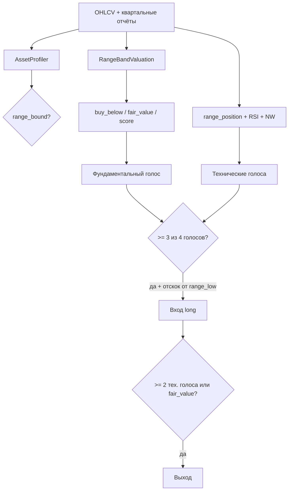

# Исследование: Range Synergy Strategy

Репозиторий: [github.com/Timofey322/flat_stocks](https://github.com/Timofey322/flat_stocks)

## 1. Суть проекта

**flat_stocks** — исследовательский бэктестер для акций, которые долго торгуются **в ценовом канале** (боковик). Пример: Li Auto (`LI`), NIO, XPeng, Alibaba.

В проекте оставлен **один лучший вариант стратегии** (по максимальной прибыли на обучающей выборке LI, май 2026):

- **Range Synergy** = канал цены + RSI + **Nadaraya–Watson envelope** + фундаментальный фильтр качества;
- голосование признаков (нужно ≥3 из 4 на вход, ≥2 из 3 на выход);
- фиксированные параметры в `BEST_STRATEGY_PARAMETERS` (`src/trading_system/config.py`).

Удалены: DCF для роста, NVIDIA, legacy-правила, несколько профилей (growth/hyper_growth), подбор сетки на каждом окне walk-forward.

---

## 2. Фундаментальный анализ — как считается

### 2.1. Данные

- Квартальные отчёты из SQLite (`data/fundamentals.db`).
- Для LI — seed `li_quarterly.json` (выручка, операционная прибыль, кэш, долг, акции).
- Для других тикеров без seed — упрощённый snapshot только по цене (технический режим).

### 2.2. Снимок компании (`FinancialSnapshot`)

Берётся **последний квартал на дату `as_of`** (без будущих отчётов):

- выручка, операционная прибыль, налог, capex, долг, кэш, число акций;
- производные: `operating_margin = operating_income / revenue`.

### 2.3. Классификатор режима (`AssetProfiler`)

Акция **range_bound**, если одновременно:

| Критерий | Смысл |
|----------|--------|
| \|тренд за 252 дня\| < 35% | нет сильного тренда |
| (max−min)/средняя за 252д ∈ [15%; 100%] | есть торгуемая ширина канала |
| годовая волатильность ∈ [15%; 75%] | достаточно движения, но не хаос |

Иначе профиль `not_range` — стратегия для исследования всё равно может быть применена с пометкой `weak fit`.

### 2.4. Оценка «range_band» (`RangeBandValuation`)

**Не DCF.** Уровни считаются с **истории цены** (только данные ≤ `as_of`):

- **Поддержка** — 10-й перцентиль `close` за 252 торговых дня;
- **Сопротивление** — 90-й перцентиль;
- **Покупать ниже** — поддержка × небольшой запас (margin of safety);
- **Fair value** — max(сопротивление, середина канала).

**Фундаментальный score** (0…1):

- 50% — низкий долг относительно выручки;
- 50% — сильный баланс (кэш / выручка).

Используется как **фильтр качества**, а не как точная «справедливая цена» в смысле DDM.

---

## 3. Технический анализ — как считается

### 3.1. Канал (`rolling_range`, окно 90 дней)

- `range_low`, `range_high` — min/max close;
- `range_position` ∈ [0, 1] — где цена внутри канала (0 = у низа).

### 3.2. RSI (14)

- Перепроданность на входе: RSI ≤ 30;
- Перекупленность на выходе: RSI ≥ 70.

### 3.3. Nadaraya–Watson Envelope (каузальный)

На каждом баре *t* регрессия по **только прошлым** ценам (Gaussian kernel):

- `nw_mid` — сглаженная оценка;
- `nw_upper` / `nw_lower` — mid ± 2.5×σ остатков;
- `nw_position` — позиция цены внутри оболочки.

Параметры лучшего варианта: bandwidth=6, multiplier=2.5, lookback=32.

**Важно:** реализация без repaint — будущие бары не влияют на прошлые сигналы.

### 3.4. ATR (14)

- Стоп: entry − 2×ATR (в бэктест-движке).

---

## 4. Как фундаментал и техника работают вместе



**Вход** (все условия):

1. ≥3 голоса из: фундаментал OK, низ канала, RSI≤30, NW у нижней полосы;
2. цена ≥ `range_low` (отскок, не нож в падающий нож).

**Выход:**

- ≥2 голоса из: верх канала, RSI≥70, NW у верхней полосы;
- **или** цена ≥ fair value (сопротивление канала).

Фундаментал **не даёт тайминг** — он отсекает покупки при слабом балансе и задаёт цель выхода у сопротивления.

---

## 5. Лучший вариант — параметры

```python
# src/trading_system/config.py — BEST_STRATEGY_PARAMETERS
range_window=90, range_entry<=0.30, range_exit>=0.80
nw_bandwidth=6, nw_multiplier=2.5, nw_lookback=32
nw_entry_position<=0.25, nw_exit_position>=0.68
synergy_min_votes_entry=3, synergy_min_votes_exit=2
rsi_entry<=30, rsi_exit>=70, max_holding_days=63, position_size=30%
```

Подобрано на train Li Auto (макс. return ~36.9%); зафиксировано для всего проекта.

---

## 6. Исследование на 4 компаниях

Период: **2023-01-01 — сегодня** (Yahoo Finance).  
Бенчмарк: **buy-and-hold** той же акции.  
Комиссия 0.1%, проскальзывание 0.05%.

| Компания | Тикер | Классификатор | Return стратегии | B&H | Excess | Alpha (год.) | MDD | Сделки |
|----------|-------|---------------|------------------|-----|--------|--------------|-----|--------|
| Li Auto | LI | weak* | **+26.7%** | −45.5% | **+72.2%** | **+9.7%** | −10.8% | 9 |
| NIO | NIO | weak* | +8.9% | −38.9% | +47.8% | −1.0% | −13.7% | 14 |
| XPeng | XPEV | yes | −5.5% | +47.9% | −53.4% | −7.3% | −23.1% | 11 |
| Alibaba | BABA | yes | +12.1% | +52.6% | −40.4% | −1.7% | −5.7% | 9 |

\* *weak* — формальный классификатор не увидел идеальный боковик, но канальная стратегия применена для сравнения.

### Выводы по кейсам

1. **Li Auto** — лучший результат исследования: стратегия в плюсе на фоне сильного падения B&H; параметры оптимизированы именно под этот тип бумаги.
2. **NIO** — умеренный плюс и большой excess vs B&H, но отрицательная alpha → альфа в основном от того, что B&H слабее, а не от стабильного skill.
3. **XPeng** — сильный тренд вверх в периоде; range-стратегия **не подходит** (отрицательный excess).
4. **Alibaba** — умеренный плюс стратегии, но B&H сильнее (тренд); низкая просадка.

**Главный вывод:** лучший вариант (NW + synergy) **релевантен для LI-подобных боковиков**; для трендовых периодов (XPEV, BABA в sample) нужен другой режим или отказ от сделок (`not_range`).

---

## 7. Альфа-метрики

Считаются в `backtest/alpha.py` (CAPM-стиль на дневных доходностях):

- **Alpha (annualized)** — избыточная доходность к рынку (B&H) после учёта beta;
- **Beta** — чувствительность к B&H;
- **Information Ratio** — mean(active return) / tracking error;
- **Excess return** — простая разница total return стратегии и B&H.

---

## 8. Утечки данных и ИИ

| Риск | Статус |
|------|--------|
| Look-ahead в индикаторах | Проверка causality — OK |
| NW repaint | Нет — каузальный расчёт |
| Фундаментал из будущего | `as_of` на train_end в walk-forward |
| ML/LLM в сигналах | **Не используется** |
| Подгонка на test | Walk-forward: параметры **фиксированы** |

При добавлении ИИ: обучать только на train, не передавать OOS-метрики в промпт оптимизатора.

---

## 9. Запуск

```powershell
pip install -e ".[dev]"
python examples/load_li_reports.py
python examples/run_research.py
pytest
```

Отчёт: `data/reports/multi_company_research.json`

---

## 10. Ограничения

- Исследование, не торговый совет.
- LI seed — ограниченный набор кварталов.
- Один набор параметров для всех тикеров — для продакшена нужна калибровка по каждому инструменту или отказ при `not_range`.
- Walk-forward OOS на LI с динамической подгонкой ранее показывал −7.5%; с **фиксированным** лучшим набором риск переобучения ниже, но не исчезает полностью.
